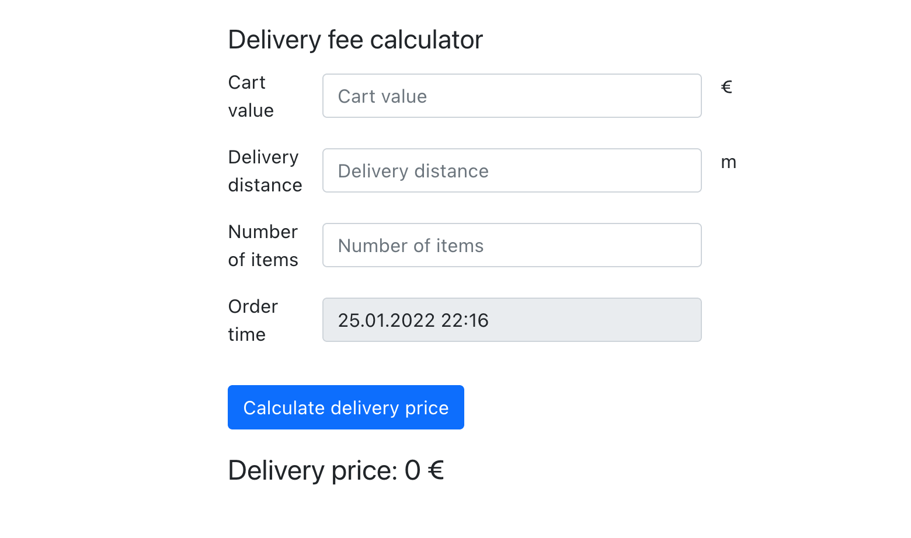

# Delivery Fee Calculator

Delivery fee calculator is an application that calculates the shipping cost based on the cart value, the number of items in the cart, the time of the order, and the delivery distance.

[Demo](https://delivery-calculator-makhova.netlify.app)



## Specification

Rules for calculating a delivery fee:

 * If the cart value is less than 10€, a small order surcharge is added to the delivery price.
The surcharge is the difference between the cart value and 10€. For example if the cart value is 8.90€, 
the surcharge will be 1.10€.

 * A delivery fee for the first 1000 meters (=1km) is 2€. If the delivery distance is longer than that, 
1€ is added for every additional 500 meters that the courier needs to travel before reaching the destination. 
Even if the distance would be shorter than 500 meters, the minimum fee is always 1€.

 * If the number of items is five or more, an additional 50 cent surcharge is added for each item above four.

 * The delivery fee can never be more than 15€, including possible surcharges.

 * The delivery is free (0€) when the cart value is equal or more than 100€.

 * During the Friday rush (3 - 7 PM UTC), the delivery fee (the total fee including possible surcharges) will 
be multiplied by 1.1x. However, the fee still cannot be more than the max (15€).

### Remarks
 * It's assumed that if the number of items in the cart is 0, then there is nothing to deliver, 
then the delivery price will be 0€.
 * It's assumed that if the cart value is 0€ but the number of items is more than 0 
(e.g. a promotion with 100% discount, free items), then the delivery price will be calculated according to 
the rules above (the surcharge for cart value will be 10€. The customer must pay for shipping even if his 
cart items are free).
 * The customer interacts with local time in the delivery form. The time is converted to UTC for the Friday rush calculation internally.
 * Given Friday rush interval is considered as inclusive start and exclusive end.
   
## Usage

### Install dependencies

```
npm install
```

### Run in the development mode
```
npm start
```
Open http://localhost:3000 to view it in the browser.

### Run tests
```
npm test
```

### Build
```
npm run build
```

Creates an optimized production build.


